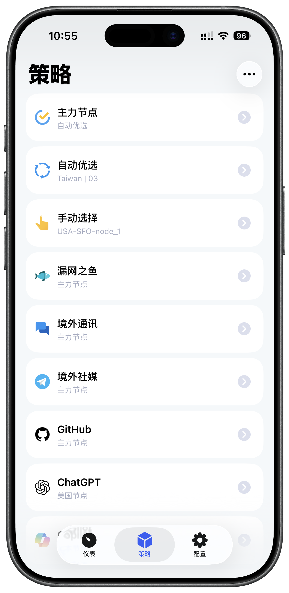

# Nitmi Rules

## 项目包含

### 1. Loon 配置

- [一键导入 Nitmi Loon 配置](https://www.nsloon.com/openloon/import?sub=https%3A%2F%2Fgh.123778.xyz%2FNitmi_Rules%2Fmain%2Floon%2FLoon_Nitmi_Full.conf)
- 配置文件：`loon/Loon_Nitmi_Full.conf`
- 配置 URL：[https://gh.123778.xyz/Nitmi_Rules/main/loon/Loon_Nitmi_Full.conf](https://gh.123778.xyz/Nitmi_Rules/main/loon/Loon_Nitmi_Full.conf)

  

### 2. 传统订阅转换配置

- 适配 [SubConverter-Extended](https://github.com/Aethersailor/SubConverter-Extended) 订阅转换后端增强版，同时兼容常规版 [SubConverter](https://github.com/tindy2013/subconverter)
- 配置文件：`convert/Custom_Clash_Full.ini`
- 配置 URL：[https://gh.123778.xyz/Nitmi_Rules/main/convert/Custom_Clash_Full.ini](https://gh.123778.xyz/Nitmi_Rules/main/convert/Custom_Clash_Full.ini)

## Loon 小白使用教程

请访问：[Loon 小白使用教程](https://loon.douok.de)

## 可选：iOS 海外平台消息推送

如果想让 Telegram 等海外平台的消息推送在移动数据下更稳定，请打开 Loon 的 APNs 相关开关。只在 Wi-Fi 下使用时，通常不需要这一步。

操作路径：`配置 - 高级配置 - 路由系统服务`，打开 `包含所有网络` 和 `包含APNS`，然后开关一次飞行模式使其生效。

## 传统订阅转换教程

Loon 用户更推荐直接使用上面的 Loon 配置导入方式，而不是传统订阅转换。

为什么要订阅转换：

- 使用的客户端不支持机场原始订阅
- 机场自带的分流规则不好用
- 需要把多个机场服务融合到一个链接中
- 相比手搓配置文件，这种方式对小白更友好

使用步骤：

1. 复制机场订阅链接。
2. 打开 [订阅转换增强版的前端网页](https://sub-converter.123778.xyz)。
3. 按提示填写各项内容。
4. 生成订阅转换链接，导入到 Clash 系以及其他客户端。

## 项目参考

- [Aethersailor/Custom_OpenClash_Rules](https://github.com/Aethersailor/Custom_OpenClash_Rules/tree/main)
- [Sleepstars/Surge-Geosite-Enhance](https://github.com/Sleepstars/Surge-Geosite-Enhance)
- [luestr/ProxyResource](https://github.com/luestr/ProxyResource)
- [fmz200/wool_scripts](https://github.com/fmz200/wool_scripts)
- [Tartarus2014/Loon-Script](https://github.com/Tartarus2014/Loon-Script)
- [blackmatrix7/ios_rule_script](https://github.com/blackmatrix7/ios_rule_script)
- [ACL4SSR/ACL4SSR](https://github.com/ACL4SSR/ACL4SSR/tree/master)
- [Loon 文档](https://nsloon.app/docs/intro)
- [LoonExampleConfig](https://github.com/Loon0x00/LoonExampleConfig)
